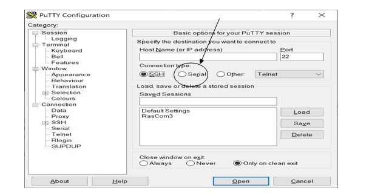

# RASPBERRY PI UART GUIDE 
**NOTE:** An SD card with at least 8 GB of storage space is required to set up the Raspberry Pi with TTL.

We must first download the OS (Operating System) for the Raspberry Pi 3 Model B.
[Visit website to get **Raspbian image file**  in zip format:](https://www.raspberrypi.com/software/operating-systems/)
	Then we will use the following link to download balenaEtcher, just to burn the SD card with OS: 
 https://www.balena.io/etcher/
## HOW TO FLASH AN OS ONTO AN SD CARD
Follow the below-listed steps: 

Insert the SD card in the card reader and put the card reader into the computer.

 Open the balenaEtcher.

## VIEWER FOR BALENAETCHER


Click on **Flash from file**, select the downloaded OS zip file and then select the SD card by clicking on **Select target**, after all, just click on **Flash!** Then OS will start burning on our SD card. When flashing and validating will be done open the boot folder of the SD card and open the **config.txt** file. In this file add a new line at the bottom.
```
dtoverlay=pi3-disable-bt
```

Save the changes in files take the card out from the card reader and put it into Raspberry Pi. Now we have to connect our TTL with our raspberry pi, as shown below.

## HOW TO CONNECT TTL WITH RASPBERRY PI 3B


We can see detailed pinout structures of Raspberry Pi 3 Model B. We can see GPIO 14(TXD) at pin = 8, GPIO 15(RXD) at pin = 10 and ground at pin = 6.

Here is the TTL connection with Raspberry pi 3B:

	
| TTL           | RASPBERRY PI       |
| :-----------   |:-----------        |
| Rx of TTL     | TXD of Raspberry   |
| Tx of TTL     | RXD of Raspberry   |
|Ground of TTL  | Ground of Raspberry|

After making the right connections, insert the TTL to the laptops port. In order to check the COM port, open the device manager and then Ports (COM & LPT), 	COM Port will appear below the port option. As shown below.
## VISUALIZATION OF THE COM PORT


For Serial Terminal and communicating with Raspberry Pi, download Putty from this link https://www.putty.org/. When you first open the putty, you'll see the following popup. 

## CONFIGURING A TTL PORT




Check Serial option as shown:

## SERIAL CATEGORY


Set TTL COM port according to your laptops ports (It will appear the same as COM 3 is shown in my case in the below figure ).
Set the board rate as 115200, and then click on **the Open button** that is shown in below figure.
## SESSION CATEGORY


When raspberry pi is connected with the TTL, it requires a login id and password for login. The default id is **“pi”** and the default password is **“raspberry”** for this we need to make our raspberry pi online. For this purpose there are following commands are given step by step:

    	ifconfig
The ifconfig (interface configuration) command is used to view and change the configuration of your system's network interfaces.
        sudo iwlist wlan0 scan
With this command, you may acquire information about wireless networks. This is a great way to list WiFi networks without having to use Network Manager.

        sudo nano /etc/wpa_supplicant/wpa_supplicant.conf
This command will help you to connect your Raspberry Pi to the internet. 


        wpa_cli -i wlan0 reconfigure

This command will help you to reconfigure your network.
###	ping 192.168.1.77 (e.g. ping any IP address)

Here you can use any IP address for ping testing (e.g. for checking connection)


After successful pinging, we will again check the IP address.

Download the VNC viewer from this link https://www.realvnc.com/en/connect/download/viewer/, install the VNC viewer and put your IP address. After Connecting with raspberry pi its operating system will open as shown below.
## VNC VIEWER


If an error occurs on VNC Viewer to connect with IP

Use the following command on the putty terminal
          	vncserver
This command will always tell us the new desktop for raspberry pi as (IP:1)
Open File on the top left of the VNC Viewer. Put (IP:1) on VNC Server and click **OK**.     

## VNC VIEWER


After this, it will require an id and password for login. The default id is **“pi”** and the default password is **“raspberry”**. After Connecting with raspberry pi its operating system will open as shown below.


## ENABLING SSH ON RASPBERRY PI 3 MODEL B
In order to enable SSH, open the putty terminal and type the command:
              
        sudo raspi-config

The following options will be displayed in putty windows; these are all Raspberry Pi 3 settings.


Select the option 3:
       
**Interface Options**

And then we can see SSH at the second option. Select the SSH option and then Enable it, using arrows keys as shown in the figure.


Finally, once we've completed all of the steps, simply reboot your Raspberry Pi with the command. 

        sudo reboot

Congratulations, we're done now.


